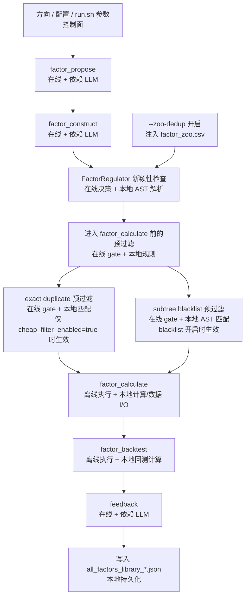
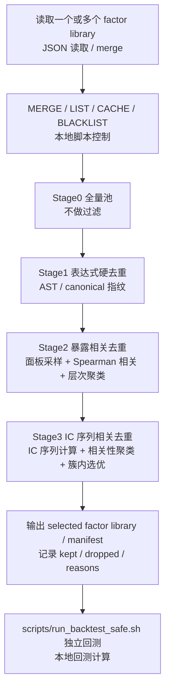

# 因子过滤与去重系统说明

## 1. 文档目的

本文档把项目里的“过滤/去重”明确拆成两套系统，避免把不同阶段的机制混在一起：

1. `run.sh` 挖掘阶段的过滤/去重
   - 目标：尽量在 `factor_calculate / factor_backtest` 之前拦掉明显重复或已知无效的表达式，减少无效算力消耗。
2. `scripts/run_factors.sh` 独立回测阶段的过滤/去重
   - 目标：在因子已经产出并落入 `all_factors_library_*.json` 之后，对候选池做离线收口，供后续独立回测使用。

一句话区分：

- `run.sh` 阶段解决“不要把明显浪费的候选继续算下去”。
- `scripts/run_factors.sh` 阶段解决“已经挖出来的一大池因子，最终拿哪一批去做离线回测”。

## 3. `run.sh` 挖掘阶段：在线过滤/去重

### 3.1 这套机制解决什么问题

`run.sh` 主流程里，过滤的核心目标不是“把最终因子池压到最小”，而是：

1. 避免明显重复的表达式继续进入计算和回测。
2. 避免命中已知坏结构的表达式继续消耗算力。
3. 在挖掘过程中维持一定的新颖性约束，减少重复探索。

这套机制发生在因子“还没正式进入离线候选池”之前，因此更像在线质量门，而不是后处理筛选器。

### 3.2 阶段流程图



### 3.3 生效机制总表

| 机制 | 开启方式 | 生效阶段 | 默认状态 | 主要作用 |
|---|---|---|---|---|
| `zoo-dedup` | `run.sh --zoo-dedup` | `factor_construct` 后的表达式评估/新颖性检查 | 关闭 | 参考历史 Zoo，限制和历史表达式过于相似的候选 |
| `exact duplicate` | `quality_gate.cheap_filter_enabled=true` | `factor_calculate` 前 | 关闭 | 过滤与已有 library / trajectory_pool 完全相同的表达式 |
| `subtree blacklist` | `run.sh --blacklist-file ...` 或环境变量 | `factor_calculate` 前 | 关闭 | 过滤命中黑名单 AST 子树的表达式 |

### 3.4 `--zoo-dedup`：跨运行的新颖性约束

入口：

```bash
./run.sh --zoo-dedup "价量因子挖掘" "suffix"
```

它做的事不是“在启动前把所有候选统一删掉一遍”，而是：

1. 把 `FACTOR_CoSTEER_FACTOR_ZOO_PATH` 指向 `data/factorlib/factor_zoo.csv`。
2. 在 `FactorRegulator.evaluate()` 里，把当前表达式和 Zoo 里的历史表达式做 AST 子树匹配。
3. 产出 `duplicated_subtree_size` 等新颖性指标，供表达式是否可接受的判定使用。

它的本质是：

- 面向“历史探索空间”的去重约束。
- 重点在“不要总是重复挖以前已经挖过的结构”。
- 它更像 novelty gate，不是最终候选池的硬唯一约束。

需要注意：

1. 当前默认链路下，`zoo-dedup` 没有一个稳定的“本次精确过滤了 N 个”的汇总计数。
2. 它主要影响表达式评估和接受概率，而不是像 `run_factors.sh Stage1` 那样做硬收口。
3. 运行结束后，`run.sh --zoo-dedup` 还会自动调用 `update_factor_zoo.py update`，把新因子补进 Zoo，供下一轮继续使用。

### 3.5 `exact duplicate`：计算前的完全重复拦截

这条机制只在下面条件成立时启用：

```yaml
quality_gate:
  cheap_filter_enabled: true
```

它发生在 `factor_calculate` 之前，主要逻辑是：

1. 读取历史 factor library 和 `trajectory_pool.json` 中已见过的表达式。
2. 做归一化后比较。
3. 若表达式与历史完全相同，则按 `duplicate_exact` 拦截。

它的本质是：

- 面向“当前实验及已有产物”的完全重复拦截。
- 重点在“不要对同一个表达式重复计算”。

当前状态需要说清楚：

1. 默认配置里 `cheap_filter_enabled=false`，因为已有 A/B 显示整体耗时是负优化。
2. 因此默认实验里，通常不会看到 `duplicate_exact` 成为主过滤路径。
3. 只有在 `cheap_filter_enabled=true` 时，才会在日志中出现 `duplicate_exact` 相关的拒绝与 `skip_reason`。

### 3.6 `--blacklist-file`：命中坏结构就提前拦截

入口：

```bash
./run.sh --blacklist-file data/factorlib/subtree_blacklist.json "价量因子挖掘" "suffix"
```

它的特点很明确：

1. 生效点在 `factor_calculate` 之前。
2. 即使 `cheap_filter_enabled=false`，只要 blacklist 开启，它也会独立生效。
3. 如果一个 task 的候选全被 blacklist 拦掉，该 task 会以 `subtree_blacklist` 作为跳过原因结束。

它的本质是：

- 面向“已知坏结构模式”的人工先验拦截。
- 重点在“某些结构已知没价值，就不要再进 calculate/backtest”。

这条机制和 `zoo-dedup` 不同：

- `zoo-dedup` 针对“和历史太像”。
- `subtree blacklist` 针对“结构本身不想再要”。

### 3.7 挖掘阶段过滤的结论

当前推荐理解方式：

1. `zoo-dedup` 是在线新颖性约束，优先防止跨运行重复探索。
2. `subtree blacklist` 是在线硬拦截，优先防止已知坏结构继续消耗算力。
3. `exact duplicate` 是在线完全重复拦截，但当前默认关闭，因为已有结果显示 cheap gate 整体不划算。

所以，`run.sh` 阶段的过滤重点不是“得到最优最终候选集”，而是“尽量别把明显浪费的候选送进重计算和回测”。

## 4. `scripts/run_factors.sh` 阶段：离线筛选/去重

### 4.1 这套机制解决什么问题

当一轮或多轮实验已经结束，`all_factors_library_*.json` 已经生成后，问题就变成：

1. 这些因子要不要合池？
2. 相同/相似表达式要不要硬去重？
3. 暴露上过于相似的因子要不要压缩？
4. 最后拿哪一版候选池去跑独立回测？

这时使用的是 `scripts/run_factors.sh`，它是后处理工具，不参与在线挖掘 loop。

入口：

```bash
./scripts/run_factors.sh
```

### 4.2 阶段流程图



### 4.3 `scripts/run_factors.sh` 的主要功能

它统一封装了四类动作：

1. `LIST`：查看历史 `all_factors_library*.json`
2. `MERGE`：多个因子库合池
3. `FILTER`：执行 `Stage0 -> Stage3`
4. `BLACKLIST`：从 Stage1 / merge JSON 或 Zoo CSV 导出 `subtree_blacklist.json`

这里最关键的是 `FILTER`，因为它决定离线候选池如何收口。

### 4.4 Stage0 -> Stage3 的含义

#### Stage0：全量池

- 输入：单个库或多个库的合并结果
- 作用：保留原始候选全集，不做收口

#### Stage1：表达式硬去重

- 作用：按表达式指纹做硬去重
- 特点：这是离线阶段真正的“one-expression -> one-factor”收口
- 用途：适合先把明显重复表达式压平，再做后续比较

这一步和 `run.sh` 里的 `zoo-dedup` 不一样：

- `run.sh` 的去重更偏在线新颖性门控
- `Stage1` 是离线硬去重收口

#### Stage2：暴露相关去重

- 作用：对 Stage1 候选做暴露相关聚类压缩
- 方法：基于样本面板上的 Spearman 相关，把高度相似暴露的因子收成较小集合
- 当前定位：默认推荐的离线候选集

为什么推荐 Stage2：

1. 它已经能显著降低回测成本。
2. 相比 Stage3，更不容易把对 LGBM 仍然有增益的因子删得过狠。
3. 当前项目经验里，Stage2 是“收益和压缩”更平衡的默认收口点。

#### Stage3：IC 序列相关去重

- 作用：在 Stage2 基础上继续压缩
- 方法：对因子的 IC 序列做相关聚类，每簇只保留冠军
- 当前定位：压缩/加速工具，不是默认收益增强步骤

为什么不建议默认把 Stage3 当主出口：

1. 下游默认是 LightGBM，树模型本身具备一定特征选择能力。
2. Stage3 容易把“相关但仍有边际增益”的因子一起删掉。
3. 当前经验中，Stage3 更适合在“必须缩小因子集、减少回测时间”时谨慎启用。

### 4.5 离线阶段和独立回测的关系

推荐链路是：

```text
all_factors_library_*.json
  -> scripts/run_factors.sh 做 MERGE / FILTER
  -> 得到 stage1 / stage2 / stage3 产物
  -> scripts/run_backtest_safe.sh 选择其中一个产物做独立回测
```

因此：

1. `scripts/run_factors.sh` 负责“挑池子”。
2. `scripts/run_backtest_safe.sh` 负责“用这个池子跑回测”。

### 4.6 离线阶段还能反哺 `run.sh`

`scripts/run_factors.sh` 不只是给后期回测用，它还能反过来服务挖掘阶段：

1. 先从 merge / Stage1 结果里抽表达式。
2. 导出 `subtree_blacklist.json`。
3. 下一轮再用 `run.sh --blacklist-file ...` 回灌到在线挖掘阶段。

所以 blacklist 的典型闭环其实是：

```text
实验产出因子库
  -> run_factors.sh 提炼 blacklist
  -> 下一轮 run.sh 用 blacklist 提前拦截
```

## 5. 哪种过滤在什么阶段起作用

| 阶段 | 机制 | 作用时点 | 主要目标 |
|---|---|---|---|
| 挖掘中 | `zoo-dedup` | `factor_construct` 后的表达式评估 | 限制跨运行重复探索 |
| 挖掘中 | `exact duplicate` | `factor_calculate` 前 | 阻止完全相同表达式重复计算 |
| 挖掘中 | `subtree blacklist` | `factor_calculate` 前 | 阻止命中坏结构的表达式进入重计算/回测 |
| 挖掘后 | `Stage1` | 因子库已生成后 | 对表达式做硬去重收口 |
| 挖掘后 | `Stage2` | Stage1 之后 | 压缩暴露高度相似的候选 |
| 挖掘后 | `Stage3` | Stage2 之后 | 进一步压缩 IC 行为相似的候选 |

## 6. 推荐使用顺序

### 场景 A：正在跑 `run.sh`，目标是减少无效算力浪费

优先考虑：

1. `--zoo-dedup`
2. `--blacklist-file`

谨慎使用：

1. `cheap_filter_enabled=true`

原因：

- 前两者更符合“在线减少浪费”的目标。
- `cheap_filter` 相关路径当前默认关闭，不建议在没有新 A/B 的前提下重新当成默认方案。

### 场景 B：实验跑完，目标是挑一版候选集做独立回测

推荐顺序：

1. `scripts/run_factors.sh` 做 `MERGE`
2. `scripts/run_factors.sh` 做 `FILTER`
3. 默认优先看 `Stage2`
4. 只有明确要进一步压缩时，再试 `Stage3`
5. 最后用 `scripts/run_backtest_safe.sh` 跑独立回测

### 场景 C：想把历史坏结构反哺到下一轮实验

推荐顺序：

1. `scripts/run_factors.sh` 先从 merge / Stage1 结果导出 blacklist
2. 下一轮 `run.sh --blacklist-file ...`
3. 对比 blacklist 开关前后的命中率、重试率、有效因子产出率

## 7. 相关入口与文件

1. 挖掘入口：`./run.sh`
2. 离线筛选入口：`./scripts/run_factors.sh`
3. 独立回测入口：`./scripts/run_backtest_safe.sh`
4. Zoo 文件：`data/factorlib/factor_zoo.csv`
5. blacklist 文件：`data/factorlib/subtree_blacklist.json`
6. 在线产物：`data/factorlib/all_factors_library_<suffix>.json`

## 8. 当前文档结论

把系统拆开后，结论应该很清楚：

1. `run.sh` 阶段的过滤/去重，重点是在线减少无效计算。
2. `scripts/run_factors.sh` 阶段的过滤/去重，重点是离线压缩最终候选池。
3. `zoo-dedup`、`subtree blacklist`、`Stage1/2/3` 不是一套东西，而是作用在不同阶段的两层系统。
4. 当前默认实践里，离线阶段优先看 `Stage2`，在线阶段优先看 `zoo-dedup + blacklist` 的组合。  
